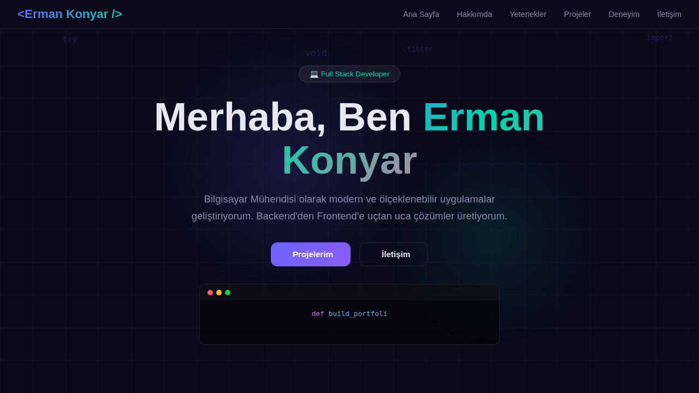
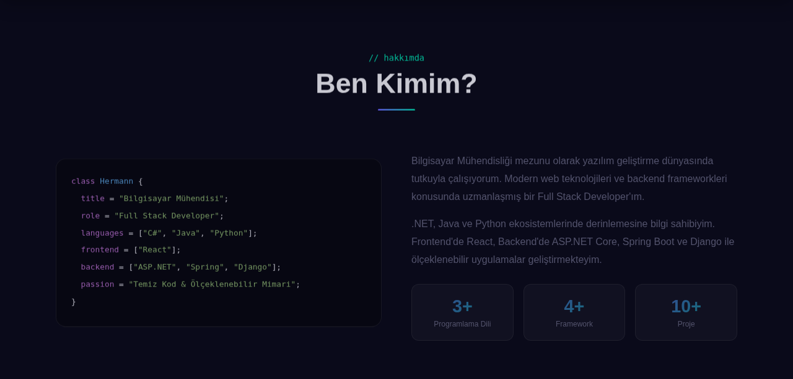
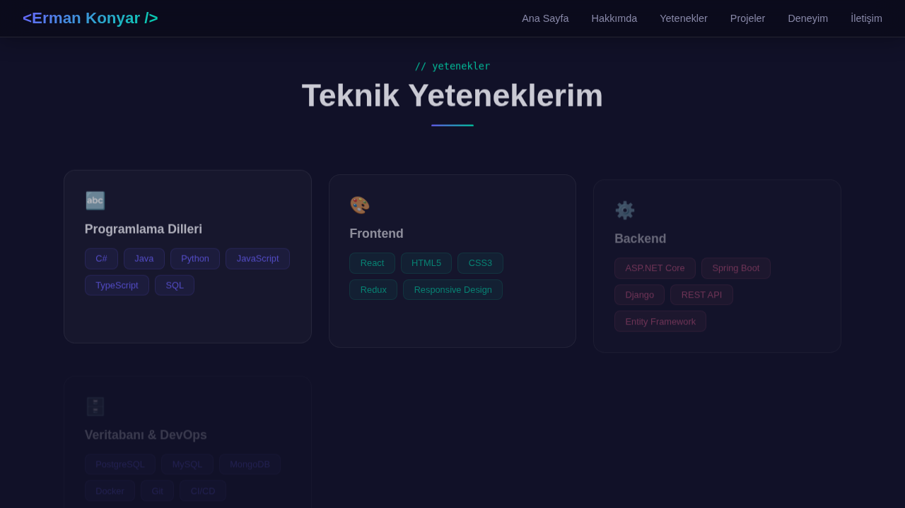
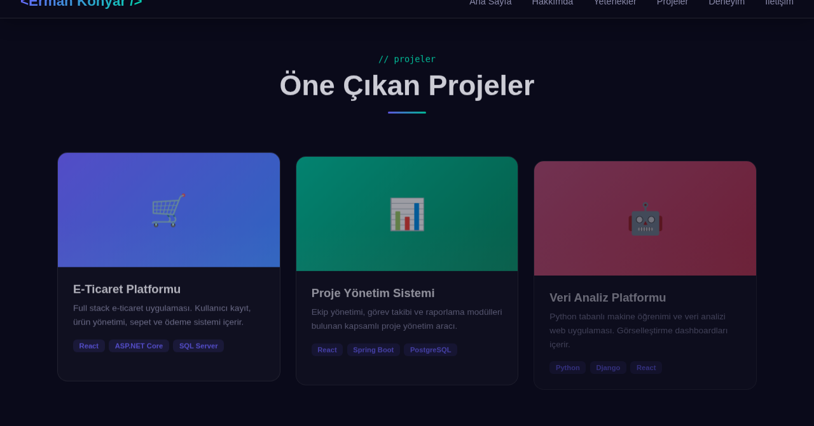
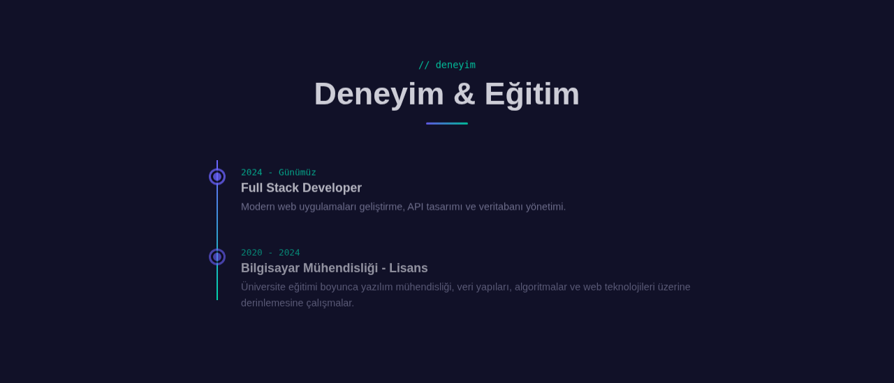
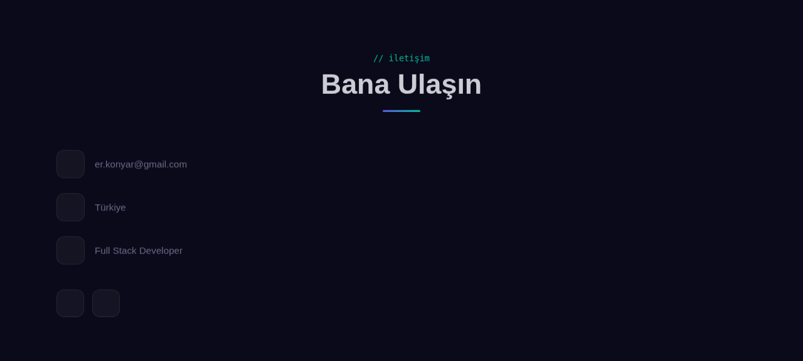

# Erman Konyar - Portfolyo

Bilgisayar Mühendisi ve Full Stack Developer olarak kişisel portfolyo web sitem. Modern glassmorphism tasarım, animasyonlar ve responsive yapı ile saf HTML/CSS/JavaScript kullanılarak geliştirilmiştir.

## Ekran Goruntuleri

### Ana Sayfa
Code rain animasyonu, typing efekti ve hero bolumuyle karsilama ekrani.



### Hakkimda
Kod formatinda kisisel bilgiler ve istatistik kartlari.



### Teknik Yetenekler
Programlama dilleri, frontend, backend ve DevOps teknolojileri.



### Projeler
One cikan projeler ve kullanilan teknolojiler.



### Deneyim & Egitim
Timeline gorunumunde is deneyimi ve egitim gecmisi.



### Iletisim
Iletisim bilgileri ve sosyal medya baglantilari.



## Teknolojiler

| Kategori | Teknolojiler |
|----------|-------------|
| **Diller** | C#, Java, Python, JavaScript, TypeScript, SQL |
| **Frontend** | React, HTML5, CSS3, Redux, Responsive Design |
| **Backend** | ASP.NET Core, Spring Boot, Django, REST API, Entity Framework |
| **Veritabani & DevOps** | PostgreSQL, MySQL, MongoDB, Docker, Git, CI/CD |

## Ozellikler

- Code rain animasyonu (hero bolumu)
- Terminal tarzi typing efekti
- Scroll ile gorunur olan animasyonlar (Intersection Observer)
- Glassmorphism tasarim dili
- Gradient animasyonlu metinler
- Tam responsive tasarim (mobil uyumlu)
- Hamburger menu (mobil)
- Smooth scrolling navigasyon

## Kurulum

Bu proje saf HTML/CSS/JavaScript ile yazilmistir. Herhangi bir build araci veya bagimliligi yoktur.

1. Repoyu klonlayin:
   ```bash
   git clone https://github.com/hermannKonyar/Portfolyo.git
   ```

2. `index.html` dosyasini tarayicinizda acin veya bir yerel sunucu baslatin:
   ```bash
   # Python ile
   python3 -m http.server 8000

   # veya Node.js ile
   npx serve .
   ```

3. Tarayicinizda `http://localhost:8000` adresine gidin.

## Proje Yapisi

```
Portfolyo/
├── index.html        # Tek dosyali uygulama (HTML + CSS + JS)
├── screenshots/      # Site ekran goruntuleri
│   ├── hero.png
│   ├── about.png
│   ├── skills.png
│   ├── projects.png
│   ├── experience.png
│   └── contact.png
└── README.md
```

## Iletisim

- **E-posta:** er.konyar@gmail.com
- **Konum:** Turkiye
- **LinkedIn:** [LinkedIn Profili](https://linkedin.com)
- **GitHub:** [GitHub Profili](https://github.com/hermannKonyar)

## Lisans

Bu proje MIT Lisansi ile lisanslanmistir.
